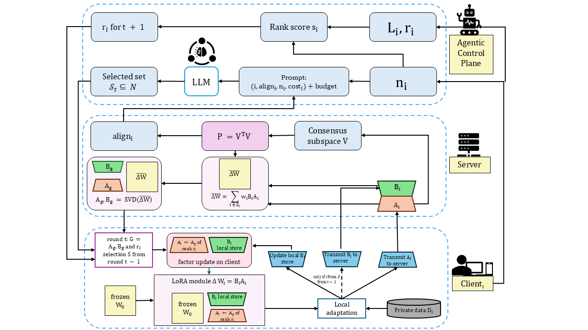
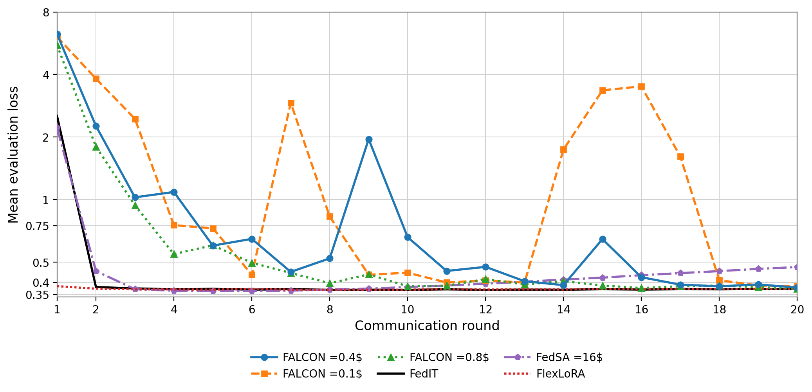

<p align="center">
  <p align="center">
    Federated Agentic LoRA for Constrained Optimization Networks
  </p>
</p>
An agent-guided selective-sharing framework for communication-efficient federated LoRA fine-tuning of Large Language Models.
---

## Architecture

<p align="center">
  
</p>

FALCON consists of three components:

| Component | Role |
|---|---|
| **Client** | Fine-tunes local LoRA adapters on private data. Uploads A always; uploads B only if selected. |
| **Server** | Constructs a consensus subspace from all A matrices, aggregates selected updates, factorizes into global adapters (A_g, B_g). |
| **Agentic Control Plane** | Computes rank scores, allocates dynamic ranks, and employs an LLM to select the B-upload subset S_t under a communication budget. |

---
## Installation

```bash
# 1. Create and activate a virtual environment
python -m venv .venv
.venv\Scripts\activate        # Windows PowerShell
# source .venv/bin/activate   # Linux / macOS

# 2. Install dependencies
pip install -r requirements.txt
```

### LLM Agent Dependency

The selection agent requires [`llama-cpp-python`](https://github.com/abetlen/llama-cpp-python). The default config downloads a **Gemma-4-E2B GGUF** model automatically on first run:

```python
# falcon/config.py
agent_repo_id    = "google/gemma-4-E2B-it-qat-q4_0-gguf"
agent_gguf_filename = "gemma-4-E2B_q4_0-it.gguf"
```

> **Note:** There is no heuristic fallback — the LLM agent is always required for the FALCON strategy. Baselines (FedIT, FedSA, FlexLoRA) do not use the agent.

---

## Quick Start

```bash
# 1. Verify the core merge math (no GPU required):
python scripts/check_merge.py

# 2. Run the full FALCON pipeline (requires GPU):
python main.py
```

Results are written to a timestamped folder under `output/`, containing:

| File | Contents |
|---|---|
| `run.log` | Full console log |
| `config.json` | Exact configuration used |
| `metrics.csv` | Per-round: mean eval loss, communication cost, # B-uploaders |
| `per_client_eval.csv` | Per-round, per-client eval loss |
| `summary.json` | Final eval loss and total communication cost |

---

## Configuration

All settings live in [`falcon/config.py`](falcon/config.py). Key parameters:

| Parameter | Default | Description |
|---|---|---|
| `baseline_method` | `"falcon"` | Strategy to run: `"falcon"`, `"fedit"`, `"fedsa"`, `"flexlora"` |
| `client_model_name` | `"Qwen/Qwen3-0.6B-Base"` | Base model for LoRA fine-tuning |
| `lora_target_modules` | `[q, k, v, o_proj]` | Self-attention modules to attach LoRA |
| `lora_dropout` | `0.05` | LoRA dropout rate |
| `rank_pool` | `[4, 8, 16, 32]` | Discrete rank pool R for FALCON; single-value list for fixed-rank baselines |
| `rank_alpha / beta / gamma` | `0.3 / 0.3 / 0.4` | Rank-score weights: data scale, learning difficulty, consensus novelty |
| `num_clients` | `8` | Number of federated clients |
| `num_rounds` | `20` | Communication rounds T |
| `local_epochs` | `1` | Local training epochs per round |
| `local_lr` | `2e-4` | AdamW learning rate |
| `max_seq_len` | `1024` | Maximum sequence length |
| `b_budget_fraction` | `0.4` | Fraction of total rank capacity allocated as B-upload budget (f_B) |
| `data_path` | `"databricks/databricks-dolly-15k"` | Hugging Face dataset path |
| `eval_fraction` | `0.1` | Hold-out fraction for local evaluation |
| `num_gpus_per_client` | `1.0` | GPU fraction per simulated client (0 for CPU-only) |

---

## Running Baselines

Switch between methods by changing `baseline_method` in [`falcon/config.py`](falcon/config.py):

```python
# FALCON (default) — dynamic rank + selective B + LLM agent
baseline_method = "falcon"
rank_pool = [4, 8, 16, 32]
b_budget_fraction = 0.4          # try 0.1, 0.4, 0.8

# FedIT — fixed rank, all clients upload A+B every round
baseline_method = "fedit"
rank_pool = [8]                   # single fixed rank

# FedSA — fixed rank, only A is shared, B stays local
baseline_method = "fedsa"
rank_pool = [16]                  # single fixed rank

# FlexLoRA — heterogeneous ranks, all clients upload A+B
baseline_method = "flexlora"
rank_pool = [2, 4, 6, 8, 10, 12, 14, 16]  # one rank per client
```

Then run:

```bash
python main.py
```

---

## Results

### Communication–Performance Trade-off

Final evaluation loss and cumulative communication cost after T = 20 rounds:

| Method | Final Loss (L_eval) | Comm. Cost | Avg. B Uploads / Round |
|---|---|---|---|
| FedIT (r = 8) | 0.3716 | 2560 | 8.00 |
| FedSA (r = 16) | 0.4741 | 2560 | 0.00 |
| FlexLoRA | 0.3715 | 2880 | 8.00 |
| **FALCON** (f_B = 0.1) | 0.3847 | 1304 | 1.05 |
| **FALCON** (f_B = 0.4) | 0.3803 | 1616 | 3.10 |
| **FALCON** (f_B = 0.8) | 0.3781 | 2100 | 5.65 |

### Evaluation Loss Over Communication Rounds

<p align="center">
  
</p>

Mean evaluation loss over communication rounds under sample-proportional aggregation. A logarithmic y-axis is used to show both the warmup rounds and the post-warmup loss range in a single plot.
